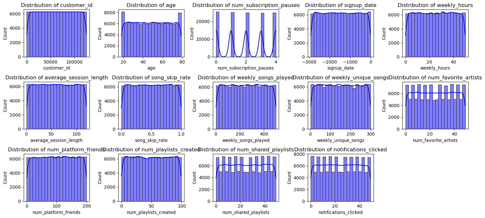
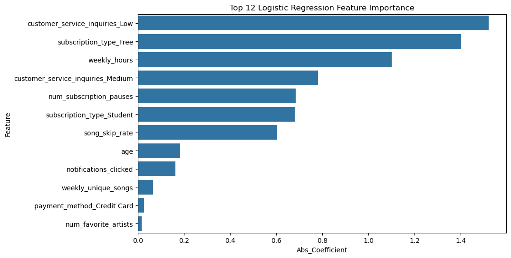
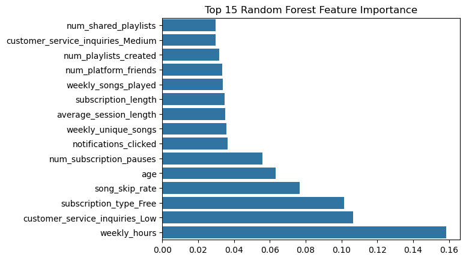
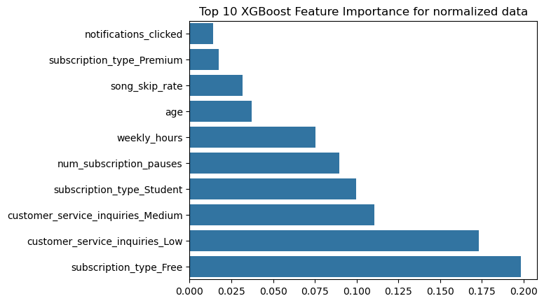
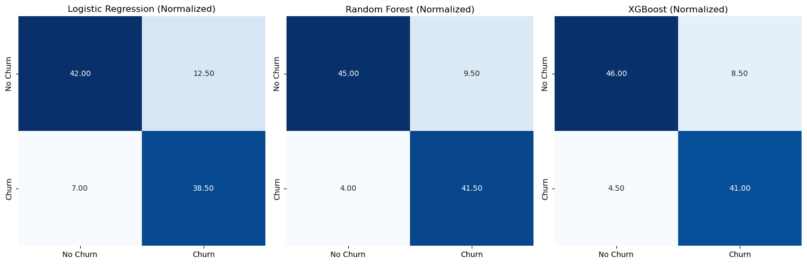
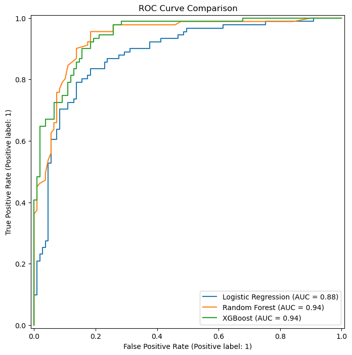
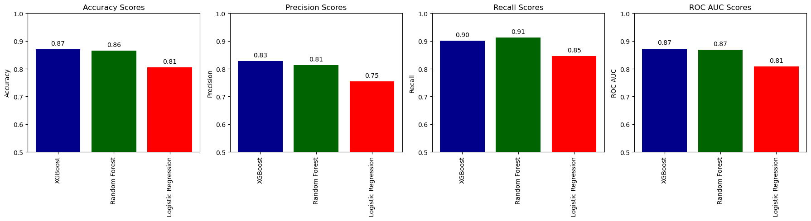

### Topic for Project: Churn Prediction Model for Subscription Services
---

# ChurnPredict: Unlocking Subscription Insights

## Abstract
**Abstract:**  
This project focuses on predicting customer churn using advanced machine learning techniques to empower subscription-based businesses with actionable insights. Leveraging a dataset containing customer demographics, subscription details, and engagement metrics, models such as Logistic Regression, Random Forest, and XGBoost were developed and optimized using hyperparameter tuning. The models were evaluated using accuracy, precision, recall, and ROC-AUC scores, providing a robust analysis of performance. The best-performing models were saved for deployment, enabling real-time churn prediction. This solution aids in proactive customer retention strategies, maximizing business revenue and customer satisfaction. Visualizations and user-friendly interfaces enhance interpretability and practical usability.

## Introduction
Subscription-based services like Netflix, Spotify, and SaaS platforms face a critical challenge in retaining their customer base. Predicting churn, where users cancel their subscriptions, is essential for implementing proactive retention strategies. This project aims to develop a robust machine-learning model that predicts subscription churn based on historical user activity, demographics, and usage patterns.

- **Classification Models:** Logistic Regression, Random Forest, and XGBoost are used to predict churn effectively.  
- **Feature Engineering:** The dataset is preprocessed using Pandas, deriving meaningful insights such as user engagement metrics and subscription length.  
- **Evaluation Metrics:** Metrics like accuracy, precision, recall, and AUC-ROC are employed to rigorously evaluate model reliability.  
- **Visualization:** Seaborn and Matplotlib are used to visualize feature importance, model performance, and churn trends.

By integrating advanced machine learning techniques and visualization, this project provides actionable insights to help businesses improve customer retention, enhance satisfaction, and maximize revenue.

## About the Dataset

The dataset for this project is sourced from the Kaggle competition [Streaming Subscription Churn Model](https://www.kaggle.com/competitions/streaming-subscription-churn-model/data). It provides detailed user information to predict subscription churn, including demographics, subscription details, usage patterns, and customer support interactions.

- **Key Features:**  
  - `customer_id`: Unique identifier for each user.  
  - `age`, `location`: User demographic information.  
  - `subscription_type`, `payment_plan`: Details about the subscription.  
  - `customer_service_inquiries`: Interaction history with customer support.  
  - `churned`: Target variable indicating whether the user churned.  

**Data Preprocessing:**  
- Categorical fields, such as `location` and `subscription_type`, were encoded using techniques like one-hot encoding or label encoding.  
- Numerical fields were normalized to ensure features have a consistent scale, which is crucial for certain machine learning algorithms.  

This structured and preprocessed dataset serves as a robust foundation for developing accurate predictive models for churn.

## Exploratory Data Analysis

### Figure 01. Histogram of Categorical data

### Figure 02. Histogram of Numerical data

## Training Models

### Figure 03. Logistic Regression Feature significance

### Figure 04. Random Forest Feature significance

### Figure 05. XGBoost Feature significance

## Model Evaluation

### Figure 06. Confusion Matrix of (a) Logistic Regression, (b) Random Forest and (c) XGBoost Classifiers

### Figure 07. ROC-AUC of Logistic Regression, Random Forest and XGBoost Classifiers

### Figure 08. Accuracy,	Precision,	Recall and 	ROC-AUC of Logistic Regression, Random Forest and XGBoost Classifiers

### Model Performance Comparison

|        Model        | Accuracy | Precision | Recall   | ROC AUC  |
|-------------------- |----------|-----------|----------|----------|
|       XGBoost       | 0.870000 | 0.828283  | 0.901099 | 0.872568 |
|    Random Forest    | 0.860000 | 0.818182  | 0.890110 | 0.862486 |
| Logistic Regression | 0.805000 | 0.754902  | 0.846154 | 0.808398 |

## Sample Result from Model

| Customer ID |  Actual Churn   | XGBoost Prediction | Random Forest Prediction | Logistic Regression Prediction |
|-------------|-----------------|--------------------|--------------------------|--------------------------------|
| **118359**  | Will Not Churn  |   Will Not Churn   |      Will Not Churn      |         Will Not Churn         |
| **112199**  | Will Not Churn  |     Will Churn     |      Will Not Churn      |           Will Churn           |
| **32131**   |   Will Churn    |     Will Churn     |        Will Churn        |         Will Not Churn         |
| **110442**  | Will Not Churn  |     Will Churn     |      Will Not Churn      |         Will Not Churn         |
| **71731**   | Will Not Churn  |   Will Not Churn   |     Will Not Churn       |         Will Not Churn         |
| **102796**  |   Will Churn    |     Will Churn     |        Will Churn        |         Will Not Churn         |
| **60860**   |   Will Churn    |   Will Not Churn   |        Will Churn        |           Will Churn           |
| **4472**    |   Will Churn    |     Will Churn     |        Will Churn        |           Will Churn           |
| **116300**  |   Will Churn    |     Will Churn     |        Will Churn        |         Will Not Churn         |
| **44575**   |   Will Churn    |   Will Not Churn   |        Will Churn        |         Will Not Churn         |

## Results and Conclusion
### Result and Conclusion
The project highlights the utility of machine learning in predicting customer churn for subscription-based businesses. By leveraging features such as user activity, demographics, and usage patterns, the models provide actionable insights to identify customers at risk of churn. This enables businesses to take proactive measures to improve customer retention and optimize their strategies for long-term success.

## Real-World Applications
- **Subscription-based Services**: Retain customers by offering personalized discounts or promotions.
- **Telecommunication**: Prevent churn by providing tailored plans or better customer service.
- **E-commerce & Retail**: Enhance loyalty programs and targeted re-engagement for at-risk customers.
- **Banking & Financial Services**: Offer exclusive benefits or improved services to retain customers.
- **Online Education**: Provide additional support or flexible payment plans to prevent course drop-offs.
- **Gaming**: Introduce new content or incentives to keep players engaged and reduce churn.
  
## Drawbacks and Future Work
### Drawbacks and Future Work:

- **Limited data adaptability**: The model may not capture sudden changes in customer behavior.  
  *Future Work*: Incorporate real-time data for quicker adaptation.

- **Feature engineering limitations**: Some customer behaviors may be overlooked.  
  *Future Work*: Use deep learning to automate feature extraction.

- **Sparse data issues**: Predicting churn for customers with minimal interaction can be challenging.  
  *Future Work*: Integrate additional data sources, like customer feedback.

- **Overfitting risk**: Complex models may overfit the data.  
  *Future Work*: Apply better cross-validation and regularization techniques.

---
---
### * If want to know more about this project there are python Notebook file, Project report paper and all other resources included in same repository.
### * Feel free to reach out, I'm open to engaging in meaningful conversations and exchanging ideas on these areas. I welcome the chance to explore new insights, collaborate on projects, and contribute to ongoing discussions in these fields.
