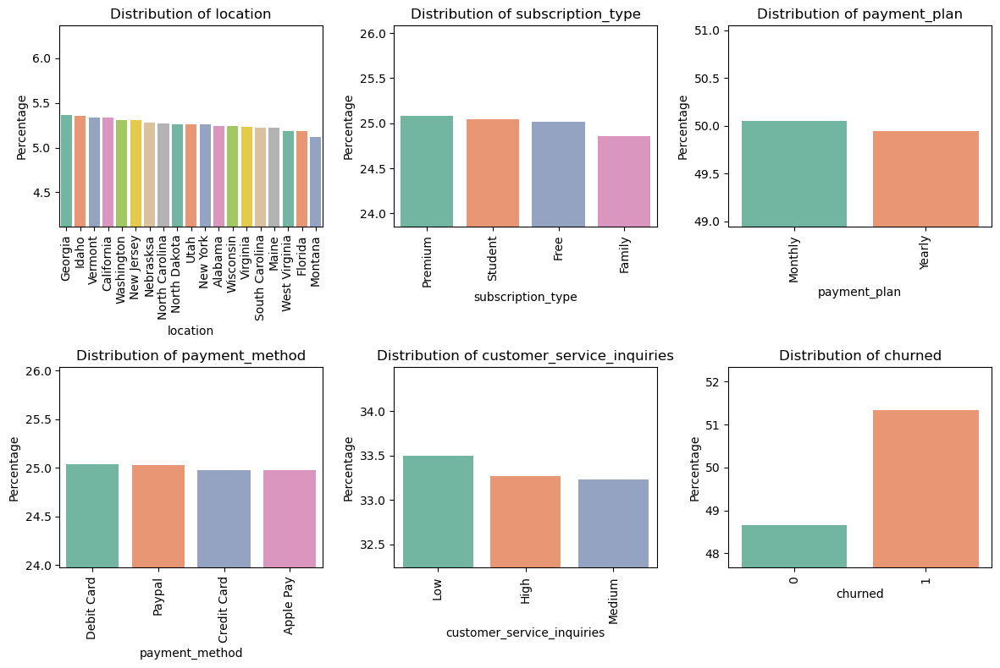

### Topic for Project: Churn Prediction Model for Subscription Services
---

# ChurnPredict: Unlocking Subscription Insights

## Abstract
**Abstract:**  
This project focuses on predicting customer churn using advanced machine learning techniques to empower subscription-based businesses with actionable insights. Leveraging a dataset containing customer demographics, subscription details, and engagement metrics, models such as Logistic Regression, Random Forest, and XGBoost were developed and optimized using hyperparameter tuning. The models were evaluated using accuracy, precision, recall, and ROC-AUC scores, providing a robust analysis of performance. The best-performing models were saved for deployment, enabling real-time churn prediction. This solution aids in proactive customer retention strategies, maximizing business revenue and customer satisfaction. Visualizations and user-friendly interfaces enhance interpretability and practical usability.

## Introduction
Subscription-based services like Netflix, Spotify, and SaaS platforms face a critical challenge in retaining their customer base. Predicting churn, where users cancel their subscriptions, is essential for implementing proactive retention strategies. This project aims to develop a robust machine-learning model that predicts subscription churn based on historical user activity, demographics, and usage patterns.

- **Classification Models:** Logistic Regression, Random Forest, and XGBoost are used to predict churn effectively.  
- **Feature Engineering:** The dataset is preprocessed using Pandas, deriving meaningful insights such as user engagement metrics and subscription length.  
- **Evaluation Metrics:** Metrics like accuracy, precision, recall, and AUC-ROC are employed to rigorously evaluate model reliability.  
- **Visualization:** Seaborn and Matplotlib are used to visualize feature importance, model performance, and churn trends.

By integrating advanced machine learning techniques and visualization, this project provides actionable insights to help businesses improve customer retention, enhance satisfaction, and maximize revenue.

## About the Dataset
**Dataset Overview:**  
The dataset for this project is sourced from the Kaggle competition [Streaming Subscription Churn Model](https://www.kaggle.com/competitions/streaming-subscription-churn-model/data). It contains detailed user information to predict subscription churn. It has 125,000 records and 20 fields. Key features include user demographics, subscription details, usage patterns, and customer service interactions.  

- **Key Columns:**  
  - `customer_id`: Unique identifier for each user.  
  - `age`, `location`: User demographic information.  
  - `subscription_type`, `payment_plan`: Details about the subscription.  
  - `customer_service_inquiries`: Interaction history with customer support.  
  - `churned`: Target variable indicating whether the user churned.  

## Exploratory Data Analysis

### Figure 01. Histogram of Categorical data

### Figure 02. Histogram of Numerical data

## Training Models

### Figure 03. Logistic Regression Feature significance

### Figure 04. Random Forest Feature significance

### Figure 05. XGBoost Feature significance

## Model Evaluation

### Figure 06. Confusion Matrix of (a) Logistic Regression, (b) Random Forest and (c) XGBoost Classifiers

### Figure 07. ROC-AUC of Logistic Regression, Random Forest and XGBoost Classifiers

### Figure 08. Accuracy,	Precision,	Recall and 	ROC-AUC of Logistic Regression, Random Forest and XGBoost Classifiers

## Result from Model

## Results and Conclusion

## Real-World Applications

## Drawbacks and Future Work
---
---
### * If want to know more about this project there are python Notebook file, Project report paper and all other resources included in same repository.
### * Feel free to reach out, I'm open to engaging in meaningful conversations and exchanging ideas on these areas. I welcome the chance to explore new insights, collaborate on projects, and contribute to ongoing discussions in these fields.
